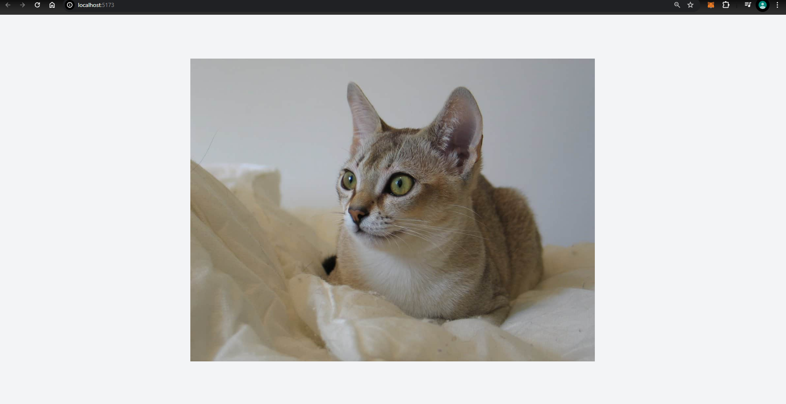

# บันทึกประจำวัน: 17 เมษายน 2024

## สิ่งที่ได้เรียนรู้

- ### เรียนรู้การสร้างโปรเจกต์ Svelte ร่วมกับการใช้งาน Tailwind CSS
    - อ่านไกด์เกี่ยวกับการใช้งาน [Tailwind CSS กับ SvelteKit](https://tailwindcss.com/docs/guides/sveltekit)

- ### ทดสอบการยิง API และเรียนรู้การใช้งาน Axios
    - #### Axios
        - ศึกษาการใช้งาน Axios ผ่าน [ไกด์นี้](https://rapidapi.com/guides/call-apis-svelte-axios)
    - #### APIs
        - ทดสอบ API จาก [API นี้](https://developers.thecatapi.com/view-account/ylX4blBYT9FaoVd6OhvR?report=bOoHBz-8t)
    - 

## ปัญหาที่พบ

- ไม่รู้วิธีการใช้งาน Tabler อย่างถูกต้อง Fixed
- ไม่สามารถทำให้ภาพเต็มหน้าจอได้ Fixed

---

# บันทึกประจำวัน: 18 เมษายน 2024

## สิ่งที่ได้เรียนรู้

- ### สร้างหน้า Login และ Register ด้วย Svelte
    - สำเร็จในการสร้างหน้า Login และ Register ด้วย Svelte

- ### ยิง API ด้วย API ที่สร้างเอง
    - #### API ที่สร้างเอง
        - เรียนรู้การใช้งาน API ที่สร้างเองจาก [โครงการ GitHub นี้](https://github.com/Chatchanan653040123-1/Massage-Project-Backend.git)
    - สำรวจการ locate ไปที่ `/cat` และแสดงรูปแมวเมื่อ status code 200 สำเร็จ

- ### การจัดเก็บโทเค็นใน `localStorage`
    - ฝึกฝนการจัดเก็บโทเค็นใน `localStorage`
- ### ใช้งาน Tabler เป็นแล้ว
    - #### Tabler Documentation
        - ศึกษาการใช้งาน Tabler ผ่าน [เอกสารนี้](https://tabler.io/preview)
- ### การ Group layout
    - layout.svelte ไว้ใช้งานทั้งหมด
    - layout@.svelte ไว้ใช้งานเฉพาะหน้าที่ต้องการ
- ### การเช็คว่าเลยล็อคอินรึยัง
    - ถ้ายังไม่เคยล็อคอินจะไม่สามารถเข้าถึงหน้า `/cat` ได้ และจะถูก redirect ไปที่หน้า Login  
## ปัญหาที่พบ

- ปัญหาในการตรวจสอบความถูกต้องของโทเค็น เพื่อให้สามารถเข้าถึงหน้า `/cat` ได้โดยไม่ต้องล็อกอิน Fixed

## สิ่งที่ได้ค้นพบ

- การเขียนโค้ดด้วย Svelte เป็นอะไรที่สนุกมาก!
